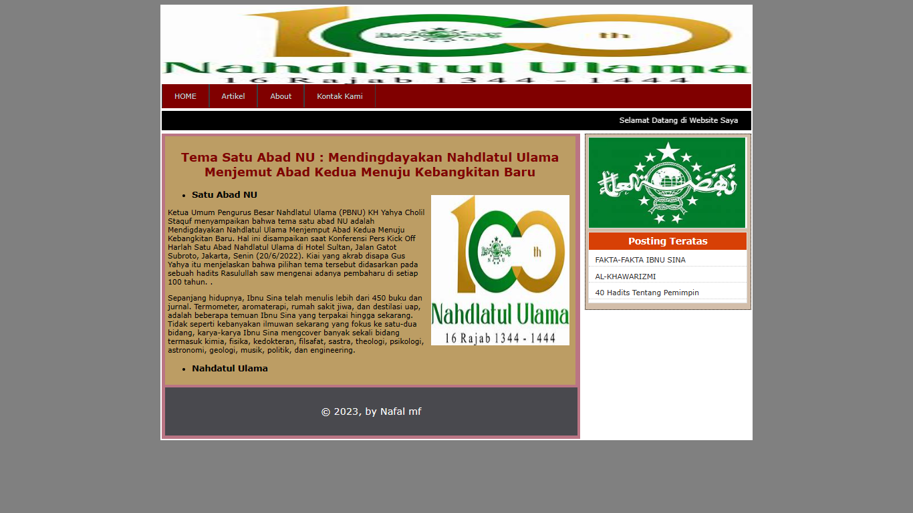

# Membuat Layout web 1

### Profil
__Nama  : Nafal mumtaz fuadi__

__Nim   : 312110457__

__Kelas : T1.21.A.2__

## Layout web
- Layout web *Menampilkan Layout web HOME*

```html
<html>
<head>
	<title>HOME KU</title>
	<link rel="stylesheet" type="text/css"
	media="all" href="style7.css">
</head>
<body>
	<div id="layout">
		<div id="header">
		
		</div>
		<div id="menu">
			<ul>
				<li><a href="home.html">HOME</a></li>
				<li><a href="Artikel.html">Artikel</a></li>
				<li><a href="profil.html">About</a></li>
				<li><a href="kontak.html">Kontak Kami</a></li>
			</ul>
			</div>
		<div id="runningtext">
		<marquee behavior="scroll" scrollamount="3" onmouseover="this.stop();" onmouseout="this.start();" direction="left">
			Selamat Datang di Website Saya
		</marquee>
		</div>
		<div id="sidebar">
		<div class="widged">
		
		</div>
		<div class="widged">
		<h1 class="judulwidged">Posting Teratas</h1>
		<ul>
			<li> <a href="posting1.html">Nafal Mumtaz Fuadi</a> </li>
			<li> <a href="posting2.html">TI.21.A.2</a> </li>
			<li> <a href="https://www.instagram.com/nfalmmfdiii_/" target="blank">INSTAGRAM SAYA</a> </li>
		</ul>
		</div>
		</div>
		<div id="isi">
			<div class="isiposting">
				<!--menampilkan gambar-->
				
				<h2>Nahdatul Ulama</h2>
				<h3> NU</h3>
				<br>
				<a href="posting1.html">
				Baca selengkapnya >>>>>
				</a>
			</div>
			<div class="isiposting">
				<!--menampilkan gambar-->
				
				<h2>Pagar Nusa</h2>
				<h3>PN</h3>
				.<br>
				<a href="posting2.html">
				Baca selengkapnya >>>>>
				</a>
			</div>
			<div class="isiposting">
				<!--menampilkan gambar-->
				
				<h2>Universitas Pelita Bangsa</h2>
				<br>
				..<br><br>
				<a href="https://ecampus.pelitabangsa.ac.id/pb/login.jsp" target="_blank">
				Baca selengkapnya di Islam is Logic >>>>>
				</a>
			</div>
		</div>
		<div id="footer"> &copy 2023, by Nafal </div>
	</div>
</body>
</html>


```

### Penjelasan
- Untuk membuat Artikel 
 
```html
<html>
<head>
	<title>Artikel</title>
	<link rel="stylesheet" type="text/css"
	media="all" href="style7.css">
</head>
<body>
	<div id="layout">
		<div id="header">
		
		</div>
		<div id="menu">
			<ul>
				<li><a href="home.html">HOME</a></li>
				<li><a href="Artikel.html">Artikel</a></li>
				<li><a href="profil.html">About</a></li>
				<li><a href="kontak.html">Kontak Kami</a></li>
			</ul>
			</div>
		<div id="runningtext">
		<marquee behavior="scroll" scrollamount="3" onmouseover="this.stop();" onmouseout="this.start();" direction="left">
			Selamat Datang di Website Saya
		</marquee>
		</div>
		<div id="sidebar">
		<div class="widged">
		
		</div>
		<div class="widged">
		<h1 class="judulwidged">Posting Teratas</h1>
		<ul>
			<li> <a href="posting1.html">FAKTA-FAKTA IBNU SINA</a> </li>
			<li> <a href="posting2.html">AL-KHAWARIZMI</a> </li>
			<li> <a href="https://islamislogic.wordpress.com/kumpulan-hadits-shahih/40-hadits-tentang-pemimpin-dan-penjelasanya/" target="blank">40 Hadits Tentang Pemimpin</a> </li>
		</ul>
		</div>
		</div>
		<div id="isi">
			<div class="isipostingall">
				<h2>Tema Satu Abad NU : Mendingdayakan Nahdlatul Ulama Menjemut Abad Kedua Menuju Kebangkitan Baru</h2>
			
			<ul>
			<li><h3>Satu Abad NU </h3></li>
			</ul>
				<p>Ketua Umum Pengurus Besar Nahdlatul Ulama (PBNU) KH Yahya Cholil Staquf menyampaikan bahwa tema satu abad NU adalah Mendigdayakan Nahdlatul Ulama Menjemput Abad Kedua Menuju Kebangkitan Baru. Hal ini disampaikan saat Konferensi Pers Kick Off Harlah Satu Abad Nahdlatul Ulama di Hotel Sultan, Jalan Gatot Subroto, Jakarta, Senin (20/6/2022). Kiai yang akrab disapa Gus Yahya itu menjelaskan bahwa pilihan tema tersebut didasarkan pada sebuah hadits Rasulullah saw mengenai adanya pembaharu di setiap 100 tahun.
					.</p>
				<p>Sepanjang hidupnya, Ibnu Sina telah menulis lebih dari 450 buku dan jurnal. Termometer, aromaterapi, rumah sakit jiwa, dan destilasi uap, adalah beberapa temuan Ibnu Sina yang terpakai hingga sekarang. Tidak seperti kebanyakan ilmuwan sekarang yang fokus ke satu-dua bidang, karya-karya Ibnu Sina mengcover banyak sekali bidang termasuk kimia, fisika, kedokteran, filsafat, sastra, theologi, psikologi, astronomi, geologi, musik, politik, dan engineering.</p>
			<ul>
			<li><h3> Nahdatul Ulama</h3></li>
			</ul>
				
		</div>
		<div id="footer"> &copy 2023, by Nafal mf </div>
	</div>
</body>
</html>

```

### SCREEN SHOT HOME


### Penjelasan
- Membuat Tampilan Artikel
```html
 <html>
<head>
	<title>Artikel</title>
	<link rel="stylesheet" type="text/css"
	media="all" href="style7.css">
</head>
<body>
	<div id="layout">
		<div id="header">
		
		</div>
		<div id="menu">
			<ul>
				<li><a href="home.html">HOME</a></li>
				<li><a href="Artikel.html">Artikel</a></li>
				<li><a href="profil.html">About</a></li>
				<li><a href="kontak.html">Kontak Kami</a></li>
			</ul>
			</div>
		<div id="runningtext">
		<marquee behavior="scroll" scrollamount="3" onmouseover="this.stop();" onmouseout="this.start();" direction="left">
			Selamat Datang di Website Saya
		</marquee>
		</div>
		<div id="sidebar">
		<div class="widged">
		
		</div>
		<div class="widged">
		<h1 class="judulwidged">Posting Teratas</h1>
		<ul>
			<li> <a href="posting1.html">FAKTA-FAKTA IBNU SINA</a> </li>
			<li> <a href="posting2.html">AL-KHAWARIZMI</a> </li>
			<li> <a href="https://islamislogic.wordpress.com/kumpulan-hadits-shahih/40-hadits-tentang-pemimpin-dan-penjelasanya/" target="blank">40 Hadits Tentang Pemimpin</a> </li>
		</ul>
		</div>
		</div>
		<div id="isi">
			<div class="isipostingall">
				<h2>Tema Satu Abad NU : Mendingdayakan Nahdlatul Ulama Menjemut Abad Kedua Menuju Kebangkitan Baru</h2>
			
			<ul>
			<li><h3>Satu Abad NU </h3></li>
			</ul>
				<p>Ketua Umum Pengurus Besar Nahdlatul Ulama (PBNU) KH Yahya Cholil Staquf menyampaikan bahwa tema satu abad NU adalah Mendigdayakan Nahdlatul Ulama Menjemput Abad Kedua Menuju Kebangkitan Baru. Hal ini disampaikan saat Konferensi Pers Kick Off Harlah Satu Abad Nahdlatul Ulama di Hotel Sultan, Jalan Gatot Subroto, Jakarta, Senin (20/6/2022). Kiai yang akrab disapa Gus Yahya itu menjelaskan bahwa pilihan tema tersebut didasarkan pada sebuah hadits Rasulullah saw mengenai adanya pembaharu di setiap 100 tahun.
					.</p>
				<p>Sepanjang hidupnya, Ibnu Sina telah menulis lebih dari 450 buku dan jurnal. Termometer, aromaterapi, rumah sakit jiwa, dan destilasi uap, adalah beberapa temuan Ibnu Sina yang terpakai hingga sekarang. Tidak seperti kebanyakan ilmuwan sekarang yang fokus ke satu-dua bidang, karya-karya Ibnu Sina mengcover banyak sekali bidang termasuk kimia, fisika, kedokteran, filsafat, sastra, theologi, psikologi, astronomi, geologi, musik, politik, dan engineering.</p>
			<ul>
			<li><h3> Nahdatul Ulama</h3></li>
			</ul>
				
		</div>
		<div id="footer"> &copy 2023, by Nafal mf </div>
	</div>
</body>
</html>

```

Output Menambahkan Data


- Jika ingin menampilkan About
```html
<html>
<head>
	<title>PROFIL SAYA</title>
	<link rel="stylesheet" type="text/css"
	media="all" href="style7.css">
</head>
<body>
	<div id="layout">
		<div id="header">
		
		</div>
		<div id="menu">
			<ul>
				<li><a href="home.html">HOME</a></li>
				<li><a href="Artikel.html">Artikel</a></li>
				<li><a href="profil.html">About</a></li>
				<li><a href="kontak.html">Kontak Kami</a></li>
			</ul>
			</div>
		<div id="runningtext">
		<marquee behavior="scroll" scrollamount="3" onmouseover="this.stop();" onmouseout="this.start();" direction="left">
			Selamat Datang di Website Saya
		</marquee>
		</div>
		<div id="sidebar">
		<div class="widged">
		
		</div>
		<div class="widged">
		<h1 class="judulwidged">Posting Teratas</h1>
		<ul>
		
			<li> <a href="https://www.instagram.com/nfalmmfdiii_/" target="blank">INSTAGRAM SAYA</a> </li>
		</ul>
		</div>
		</div>
		<div id="isi">
			<div class="isipostingall">
			<h2> Tentang Saya </h2><br>
			
			<table class="table">
				<tr>
					<td> Nama Lengkap </td>
					<td> : Nafal Mumtaz Fuadi </td>
				</tr>
				<tr>
					<td> Jenis Kelamin </td>
					<td> : Laki-laki </td>
				</tr>
				<tr>
					<td> Agama </td>
					<td> : Islam </td>
				</tr>
				<tr>
					<td> Tempat/Tanggal Lahir </td>
					<td> : Bekasi/06 Desember 2002 </td>
				</tr>
				<tr>
					<td> Alamat </td>
					<td> : Cikarang utara </td>
				</tr>
				<tr>
					<td> Universitas </td>
					<td> : Universitas Pelita bangsa </td>
				</tr>
				<tr>
					<td> NIM </td>
					<td> : 312110457 </td>
				</tr>
				<tr>
					<td> Fakultas </td>
					<td> : Teknik </td>
				</tr>
				<tr>
					<td> Program Studi </td>
					<td> : Teknik Informatika (S1) </td>
				</tr>
				<tr>
					<td> Angkatan </td>
					<td> : 2021 </td>
				</tr>
				<tr>
					<td> Moto Hidup </td>
					<td> : Looking Forward! Never Give Up! </td>
				</tr>
			</table>
			</div>
		</div>
		<div id="footer"> &copy 2022, by nafdi (NAFAL MUMTAZ FUADI) </div>
	</div>
</body>
</html>

```


- Menambahkan Tampilan Kontak

```html
  <html>
<head>
	<title>KONTAK KITA</title>
	<link rel="stylesheet" type="text/css"
	media="all" href="style7.css">
</head>
<body>
	<div id="layout">
		<div id="header">
		
		</div>
		<div id="menu">
			<ul>
				<li><a href="home.html">HOME</a></li>
				<li><a href="Artikel.html">Artikel</a></li>
				<li><a href="profil.html">About</a></li>
				<li><a href="kontak.html">Kontak Kami</a></li>
			</ul>
			</div>
		<div id="runningtext">
		<marquee behavior="scroll" scrollamount="3" onmouseover="this.stop();" onmouseout="this.start();" direction="left">
			Selamat Datang di Website Saya
		</marquee>
		</div>
		<div id="kontak">
			<div class="kontak">
			<h2> Kontak Kami </h2><br>
				<form>
				<table class="tablekontak">
				<tr>
					<td class="kolom1"> Nama Lengkap </td>
					<td class="kolom2"> <INPUT TYPE=text NAME=txtNama size="50"> </td>
				</tr>
				<tr>
					<td> E-mail </td>
					<td> <INPUT TYPE=text NAME=txtemail size="50"> </td>
				</tr>
				<tr>
					<td> No. HP </td>
					<td> <INPUT TYPE=text NAME=txtnohp size="50"> </td>
				</tr>
				<tr>
					<td> Kota </td>
					<td> <INPUT TYPE=text NAME=txtkota size="50"> </td>
				</tr>
				<tr>
					<td>  Pesan </td>
					<td> <textarea cols="80" rows="10"></textarea> </td>
				</tr>
				<tr>
					<td>&nbsp;</td>
					<td>&nbsp;</td>
				</tr>	
				
				<tr>
					<td>&nbsp;</td>
					<td><INPUT TYPE=submit NAME=kirim value=&nbsp;&nbsp;kirim&nbsp;&nbsp;>&nbsp;&nbsp;<INPUT TYPE=Reset Name=reset Value=&nbsp;&nbsp;reset&nbsp;&nbsp;> </td>
				</tr>
				
			</table>
			</form>
			</div>
		</div>
		<div id="footer"> &copy 2022, nafdi </div>
	</div>
</body>
</html>

```


## Sekian dan Terima Kasih
